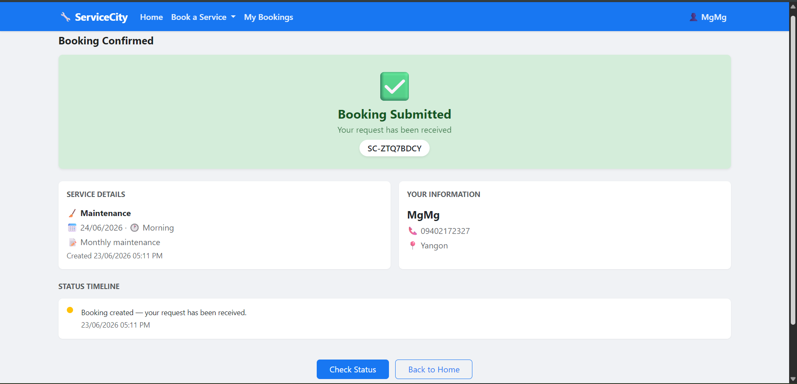
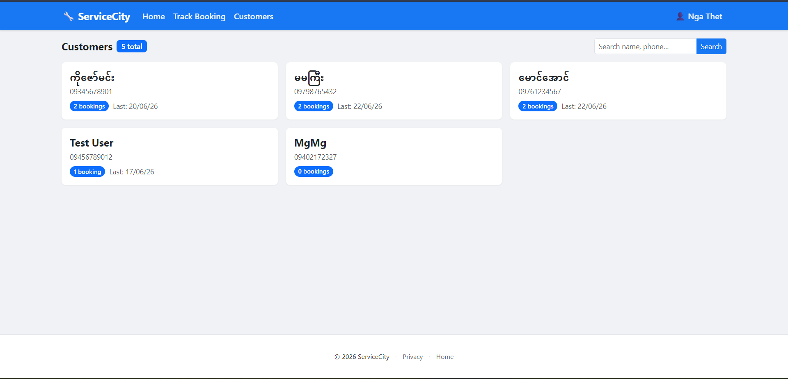
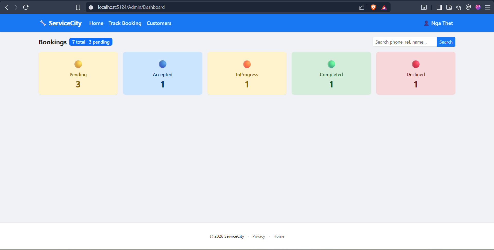
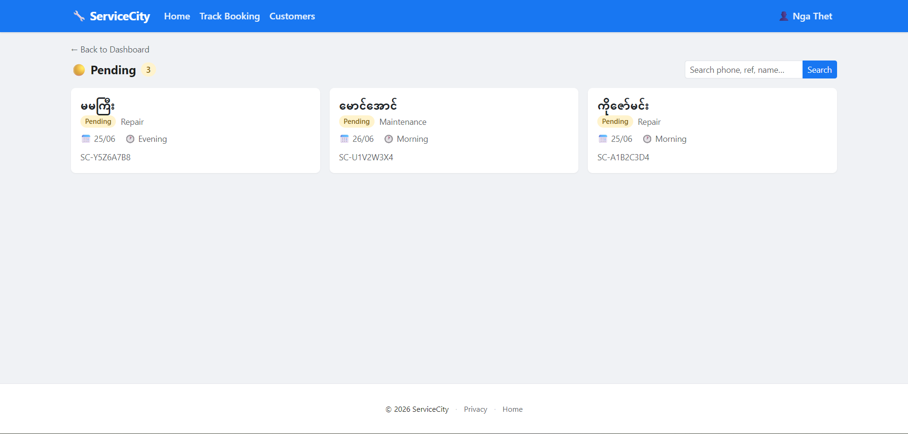
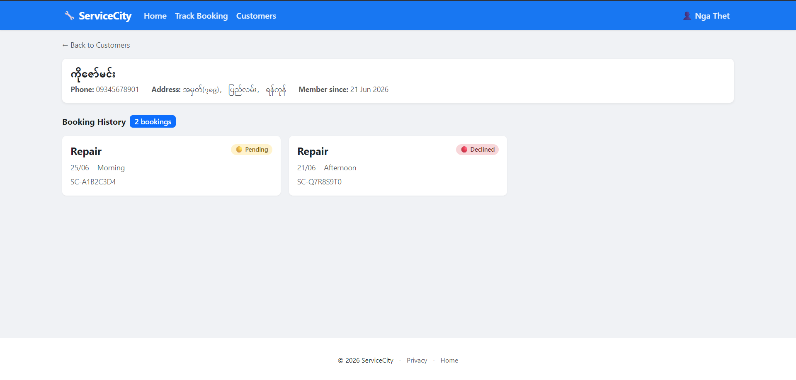
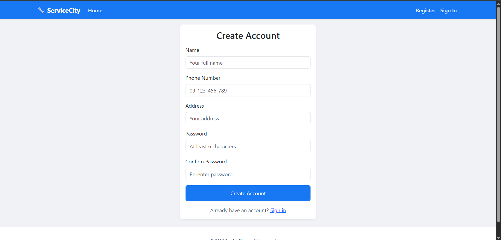
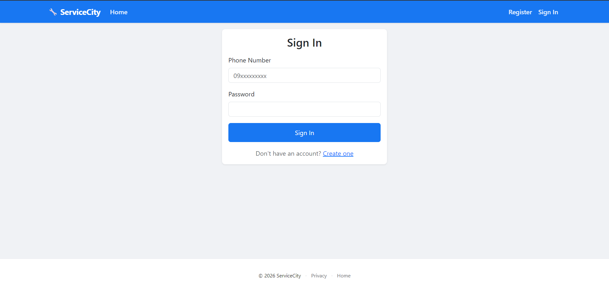
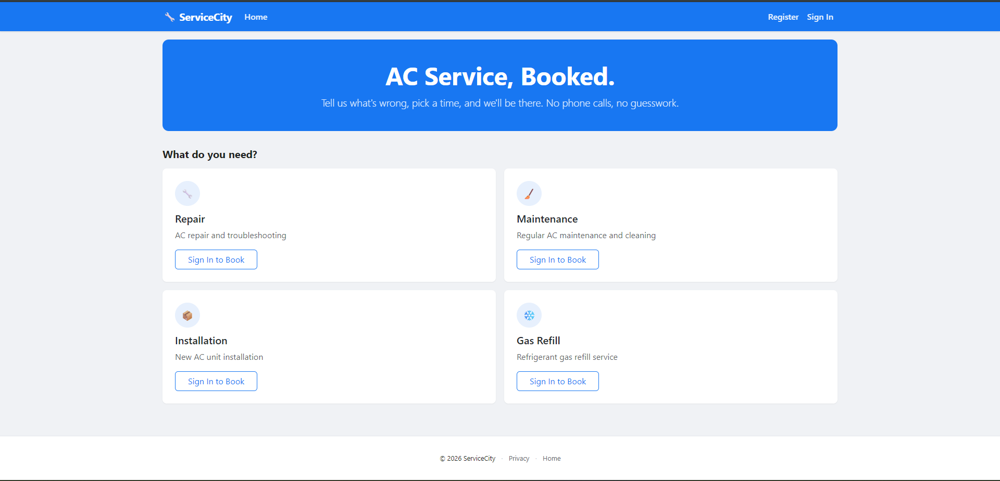

# 🔧 ServiceCity

> A web-based air conditioning service booking platform for Myanmar — schedule repairs, track status, get help without phone tag.

**Core Value:** Users can book AC service and know exactly when help is coming — no phone tag, no uncertainty.

---

## 📱 Screenshots


*Booking confirmed — customer sees reference number and status*


*Admin — view customer details and booking history*


*Admin — browse and manage all customers*


*Admin home page — overview and navigation*


*Admin — booking detail with actions*


*Admin — customer detail view*


*Customer registration page*


*Sign in page*


*Visitor/guest view of the platform*

---

## ✨ Features

| Feature | Description |
|---------|-------------|
| 📋 **Book a Service** | Select category (Repair, Maintenance, Installation, Gas Refill), fill form, pick date/time — get a unique reference number |
| 📍 **Track Booking** | Search by phone, name, address, or reference number — guests can look up bookings without an account |
| 👤 **My Bookings** | Authenticated customers see all their bookings in one place with status badges and timeline |
| 📊 **Admin Dashboard** | 5 status summary cards with counts, per-status drill-down pages, unified search across all fields |
| ✅ **Admin Actions** | Accept with estimated arrival time, decline with reason, mark in-progress/completed |
| 🔔 **In-App Notifications** | Status updates appear on the customer's booking timeline in real-time |
| 📱 **Mobile-First** | Responsive design built for Myanmar's phone-dominant user base |
| 🎨 **Unified UI** | Consistent page headers (title + count + search) across all admin and customer pages |

---

## 🛠 Tech Stack

| Technology | Version | Purpose |
|------------|---------|---------|
| .NET | 10 (LTS) | Application runtime |
| ASP.NET Core MVC | 10.x | Web framework — server-rendered Razor views |
| Entity Framework Core | 10.x | ORM + code-first migrations |
| PostgreSQL | 16+ | Relational database |
| Bootstrap | 5.3 | Responsive UI framework (CDN) |
| Docker | — | Containerization |

---

## 🚀 Getting Started

### Prerequisites

- [.NET 10 SDK](https://dotnet.microsoft.com/download)
- [Docker](https://www.docker.com/get-started) & Docker Compose (recommended)
- PostgreSQL 16+ (if not using Docker)

### Quick Start with Docker

```bash
git clone https://github.com/thetzinsoe/ServiceCity.git
cd ServiceCity
docker compose up --build
```

App runs at **http://localhost:5124**

### Local Development

```bash
# Restore dependencies
dotnet restore

# Build
dotnet build

# Run
cd ServiceCity
dotnet run
```

### Database Setup

```bash
# Apply migrations
dotnet ef database update --project ServiceCity.Data
```

Seed data creates 4 service categories: Repair, Maintenance, Installation, Gas Refill.

---

## 📁 Project Structure

```
ServiceCity/
├── ServiceCity/                  # Web project
│   ├── Controllers/              # MVC controllers
│   │   ├── AdminController.cs    # Dashboard, actions, customers
│   │   ├── AuthController.cs     # Sign in, register, sign out
│   │   ├── BookingController.cs  # Create, status, my bookings
│   │   └── HomeController.cs     # Home page, privacy
│   ├── Views/                    # Razor views
│   │   ├── Admin/                # Dashboard, drill-down, details
│   │   ├── Auth/                 # Sign in, register, settings
│   │   ├── Booking/              # Create, status, confirmation
│   │   ├── Home/                 # Index, privacy
│   │   └── Shared/               # _Layout, _ValidationScripts
│   ├── Models/                   # View models
│   └── wwwroot/                  # Static files (CSS, JS)
│
├── ServiceCity.Core/             # Domain layer
│   ├── Entities/                 # Booking, User, Notification, ServiceCategory
│   └── Enums/                    # BookingStatus, PreferredTimeSlot
│
├── ServiceCity.Data/             # Data access layer
│   ├── AppDbContext.cs           # EF Core DbContext
│   └── Migrations/               # Database migrations
│
├── .planning/                    # Phase plans, research, roadmap
├── docker-compose.yml            # Docker orchestration
├── Dockerfile                    # Multi-stage build
└── CLAUDE.md                     # Project instructions
```

---

## 🔄 Booking Flow

```
Customer                    System                      Admin
   │                          │                           │
   ├─ Book a Service ────────►│                           │
   │                          ├─ Create booking ─────────►│
   │                          │  (SC-XXXXXXXX)            │
   │◄─ Confirmation ───────── ┤                           │
   │                          │                           ├─ Review
   │                          │◄── Accept/Decline ────────┤
   │◄─ Status update ──────── ┤                           │
   │   (timeline notification)│                           │
   │                          │◄── Start Service ─────────┤
   │◄─ Status update ──────── ┤                           │
   │                          │◄── Complete ──────────────┤
   │◄─ Status update ──────── ┤                           │
```

---

## 🏗 Architecture

- **MVC Pattern** — Controllers handle requests, Views render HTML, Models carry data
- **Service Layer** — Business logic in service classes, thin controllers
- **EF Core** — Code-first migrations, PostgreSQL via Npgsql
- **Session Auth** — Phone + name based, no email/password dependency
- **In-App Notifications** — Status/message model stored in PostgreSQL
- **Unified Search** — Search across phone, name, address, and reference number (admin gets full access, guests search by phone/reference)

---

## 📄 License

MIT
